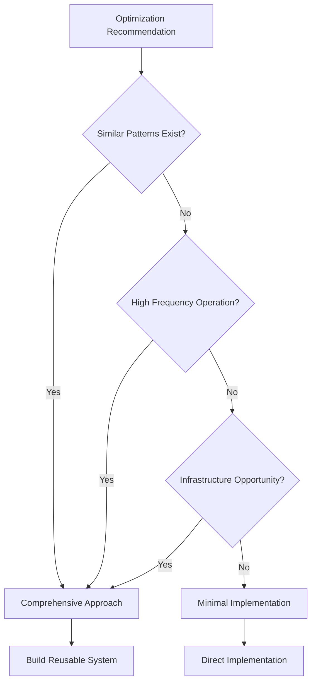

# Performance Optimization Training Framework

## Overview

This framework provides a systematic approach for evaluating and implementing performance optimizations based on the successful database index case study where a simple recommendation was transformed into a comprehensive optimization system with 4-6x the expected impact.

---

## Quick Decision Tree



---

## Phase 1: Recommendation Evaluation

### 1.1 Initial Assessment Template

```typescript
interface InitialAssessment {
  recommendation: {
    description: string;
    category: 'performance' | 'security' | 'maintainability';
    expectedImpact: string;
    estimatedEffort: string;
  };

  // Critical questions to answer
  evaluation: {
    scopeQuestion: string;        // "Is this the only instance?"
    patternQuestion: string;      // "Where else does this pattern occur?"
    infrastructureQuestion: string; // "Can we build reusable tooling?"
    measurementQuestion: string;  // "How will we validate impact?"
  };
}
```

### 1.2 Pattern Detection Checklist

- [ ] Search codebase for similar operations
- [ ] Analyze performance profiles for related bottlenecks
- [ ] Review error logs for related issues
- [ ] Check monitoring dashboards for patterns
- [ ] Interview team about known pain points

### 1.3 Impact Multiplier Analysis

```typescript
function calculateImpactMultiplier(
  originalScope: Optimization,
  expandedScope: Optimization[]
): number {
  const factors = {
    patternCount: expandedScope.length,
    frequencyMultiplier: expandedScope.reduce((sum, o) => sum + o.frequency, 0),
    criticalityScore: expandedScope.filter(o => o.critical).length,
    reusabilityFactor: expandedScope.filter(o => o.reusable).length / expandedScope.length
  };

  return factors.patternCount *
         factors.frequencyMultiplier *
         (1 + factors.criticalityScore * 0.5) *
         (1 + factors.reusabilityFactor);
}
```

---

## Phase 2: Solution Design

### 2.1 Comprehensive vs Minimal Decision Matrix

| Factor | Weight | Minimal | Comprehensive |
|--------|--------|---------|---------------|
| Multiple similar patterns | 30% | 0 | 1 |
| High frequency operation | 25% | 0 | 1 |
| Infrastructure opportunity | 20% | 0 | 1 |
| Team can maintain | 15% | 1 | 1 |
| Rollback possible | 10% | 1 | 1 |

**Score > 0.6**: Go comprehensive
**Score < 0.4**: Go minimal
**Score 0.4-0.6**: Team decision

### 2.2 Infrastructure Components Template

```typescript
class OptimizationInfrastructure {
  // Core components for comprehensive optimization

  // 1. Analysis Tools
  analyzer: {
    patternDetector: PatternAnalyzer;
    performanceProfiler: Profiler;
    impactEstimator: ImpactCalculator;
  };

  // 2. Implementation Tools
  implementation: {
    optimizer: OptimizationEngine;
    validator: PerformanceValidator;
    rollback: RollbackManager;
  };

  // 3. Management Tools
  management: {
    cli: CommandLineInterface;
    monitoring: MonitoringDashboard;
    reporting: ReportGenerator;
  };

  // 4. Safety Mechanisms
  safety: {
    dryRun: DryRunSimulator;
    staging: StagingTester;
    progressive: ProgressiveRollout;
  };
}
```

### 2.3 Composite Optimization Patterns

```typescript
// Pattern: Combine related optimizations
class CompositeOptimization {
  // Instead of: Single index on email
  // Do: Multiple strategic indexes

  strategies = {
    indexing: {
      single: "CREATE INDEX ON users(email)",
      composite: [
        "CREATE INDEX ON users(email, status, updated_at)",
        "CREATE INDEX ON users(organization, role, created_at)",
        "CREATE INDEX ON users(last_login, active)"
      ]
    },

    caching: {
      single: "Cache user by email",
      composite: {
        L1: "In-memory user cache",
        L2: "Redis distributed cache",
        L3: "CDN edge cache",
        patterns: ["user:*", "session:*", "permissions:*"]
      }
    },

    queryOptimization: {
      single: "Optimize one query",
      composite: {
        analyzeAll: "Profile all queries",
        optimizeTop: "Fix top 20% causing 80% load",
        createFramework: "Query optimization framework"
      }
    }
  };
}
```

---

## Phase 3: Implementation Strategy

### 3.1 Progressive Implementation Plan

```typescript
interface ProgressiveImplementation {
  phases: {
    phase1_analysis: {
      duration: "1-2 days";
      deliverables: ["Pattern analysis", "Impact estimation", "Risk assessment"];
    };

    phase2_prototype: {
      duration: "2-3 days";
      deliverables: ["Proof of concept", "Performance tests", "Rollback plan"];
    };

    phase3_infrastructure: {
      duration: "3-5 days";
      deliverables: ["CLI tools", "Monitoring", "Documentation"];
    };

    phase4_rollout: {
      duration: "2-3 days";
      deliverables: ["Production deployment", "Validation", "Training"];
    };
  };

  gates: {
    afterPhase1: "Impact > 2x original estimate?";
    afterPhase2: "Tests show expected improvement?";
    afterPhase3: "Infrastructure stable?";
    afterPhase4: "Metrics meet targets?";
  };
}
```

### 3.2 Validation Framework

```typescript
class ValidationFramework {
  // Before implementation
  async baseline(): Promise<Metrics> {
    return {
      performance: await this.measureCurrentPerformance(),
      errors: await this.countCurrentErrors(),
      resources: await this.measureResourceUsage()
    };
  }

  // During implementation
  async validate(optimization: Optimization): Promise<ValidationResult> {
    const tests = [
      this.performanceTest(optimization),
      this.regressionTest(optimization),
      this.loadTest(optimization),
      this.edgeCaseTest(optimization)
    ];

    const results = await Promise.all(tests);
    return {
      passed: results.every(r => r.passed),
      improvement: this.calculateImprovement(results),
      risks: this.identifyRisks(results)
    };
  }

  // After implementation
  async monitor(): Promise<void> {
    setInterval(async () => {
      const metrics = await this.collectMetrics();
      if (metrics.degradation) {
        await this.alert(metrics);
        if (metrics.critical) {
          await this.autoRollback();
        }
      }
    }, 60000); // Every minute
  }
}
```

### 3.3 Rollback Strategy

```typescript
class RollbackStrategy {
  strategies = {
    database: {
      prepare: "Backup current state",
      execute: "DROP INDEX IF EXISTS",
      verify: "Check query plans reverted"
    },

    code: {
      prepare: "Tag current version",
      execute: "Git revert or feature flag",
      verify: "Run regression tests"
    },

    configuration: {
      prepare: "Snapshot current config",
      execute: "Restore previous values",
      verify: "Validate service health"
    }
  };

  async executeRollback(component: string): Promise<void> {
    const strategy = this.strategies[component];

    // 1. Prepare
    await this.backup(strategy.prepare);

    // 2. Execute
    await this.rollback(strategy.execute);

    // 3. Verify
    const success = await this.verify(strategy.verify);

    if (!success) {
      throw new Error(`Rollback failed for ${component}`);
    }
  }
}
```

---

## Phase 4: Measurement & Monitoring

### 4.1 Key Performance Indicators (KPIs)

```typescript
interface OptimizationKPIs {
  // Primary metrics
  primary: {
    responseTime: { before: number; after: number; improvement: string; };
    throughput: { before: number; after: number; improvement: string; };
    errorRate: { before: number; after: number; improvement: string; };
  };

  // Secondary metrics
  secondary: {
    cpuUsage: number;
    memoryUsage: number;
    diskIO: number;
    networkLatency: number;
  };

  // Business metrics
  business: {
    userExperience: number; // Core Web Vitals
    costSavings: number;    // Infrastructure costs
    developerVelocity: number; // Time saved debugging
  };
}
```

### 4.2 Monitoring Dashboard Template

```typescript
class MonitoringDashboard {
  panels = {
    performance: {
      queries: ["P50", "P95", "P99 response times"],
      throughput: ["Requests per second", "Queries per second"],
      errors: ["Error rate", "Timeout rate"]
    },

    optimization: {
      indexUsage: "Percentage of queries using indexes",
      cacheHitRate: "Cache effectiveness",
      optimizedPaths: "Percentage of optimized code paths"
    },

    alerts: {
      degradation: "Performance below baseline",
      anomaly: "Unusual patterns detected",
      threshold: "SLA thresholds approached"
    }
  };

  async generateReport(): Promise<Report> {
    return {
      daily: await this.dailyTrends(),
      weekly: await this.weeklyComparison(),
      monthly: await this.monthlyAnalysis(),
      recommendations: await this.generateRecommendations()
    };
  }
}
```

---

## Phase 5: Knowledge Transfer

### 5.1 Documentation Template

```markdown
# [Optimization Name] Implementation

## Overview
- **Original Issue**: [Description]
- **Solution**: [Comprehensive approach]
- **Impact**: [Actual vs Expected]
- **ROI**: [Multiplier achieved]

## Technical Details
### Patterns Identified
1. [Pattern 1]: [Description and frequency]
2. [Pattern 2]: [Description and frequency]

### Solution Architecture
[Diagram or code structure]

### Performance Results
| Metric | Before | After | Improvement |
|--------|--------|-------|-------------|
| [Metric1] | X | Y | Z% |

## Usage Instructions
### CLI Tools
\```bash
# Commands and examples
\```

### Monitoring
- Dashboard: [URL]
- Alerts: [Configuration]

## Rollback Procedure
1. [Step 1]
2. [Step 2]

## Lessons Learned
- [Key insight 1]
- [Key insight 2]
```

### 5.2 Team Training Checklist

- [ ] Code review of implementation
- [ ] Walkthrough of infrastructure components
- [ ] Hands-on with CLI tools
- [ ] Monitoring dashboard training
- [ ] Rollback procedure practice
- [ ] Q&A session
- [ ] Documentation review
- [ ] Future optimization planning

---

## Best Practices Summary

### DO's
✅ Look for patterns beyond the specific recommendation
✅ Build reusable infrastructure for future optimizations
✅ Measure everything - before, during, and after
✅ Create comprehensive testing and validation
✅ Document patterns and learnings
✅ Implement progressive rollout with gates
✅ Build monitoring and alerting from day one
✅ Design for rollback from the start

### DON'Ts
❌ Implement exactly as specified without analysis
❌ Skip validation and measurement
❌ Create one-off solutions without reusability
❌ Ignore similar patterns in the codebase
❌ Deploy without rollback capability
❌ Forget to document the implementation
❌ Miss the opportunity to build infrastructure
❌ Assume expected impact equals actual impact

---

## Quick Reference Cards

### Card 1: Optimization Multiplier Factors
- **Pattern count**: How many similar issues exist?
- **Frequency**: How often is this code path executed?
- **Criticality**: Is this user-facing or system-critical?
- **Reusability**: Can the solution be reused?
- **Infrastructure**: Can we build tools around this?

### Card 2: Infrastructure Components Checklist
- [ ] Analysis tools (profiler, pattern detector)
- [ ] Implementation engine (optimizer, validator)
- [ ] Management interface (CLI, dashboard)
- [ ] Safety mechanisms (dry-run, rollback)
- [ ] Monitoring system (metrics, alerts)
- [ ] Documentation generator

### Card 3: Risk Mitigation Strategy
1. **Baseline**: Measure current state
2. **Prototype**: Test in development
3. **Validate**: Confirm improvements
4. **Stage**: Test in staging environment
5. **Progressive**: Roll out incrementally
6. **Monitor**: Watch for degradation
7. **Rollback**: Have escape plan ready

### Card 4: Success Metrics Framework
- **Immediate**: Performance improvement percentage
- **Scope**: Number of patterns optimized
- **Infrastructure**: Reusable components created
- **Future**: Time saved on next optimization
- **Risk**: Safety mechanisms in place
- **Knowledge**: Team trained and documented

---

## Conclusion

Transform optimization recommendations from point solutions to comprehensive improvements by:

1. **Analyzing** beyond the immediate recommendation
2. **Identifying** patterns and opportunities
3. **Building** reusable infrastructure
4. **Validating** with comprehensive testing
5. **Monitoring** continuously post-deployment
6. **Documenting** for future reference

The goal is not just to implement the optimization, but to build capability for future optimizations while achieving 3-5x the expected impact through comprehensive pattern-based solutions.